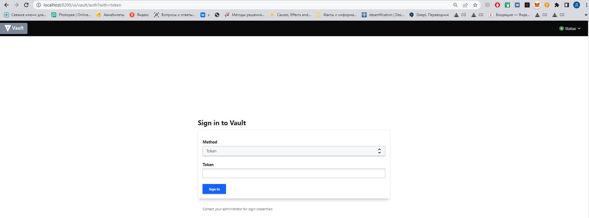
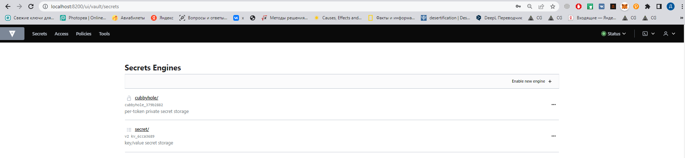
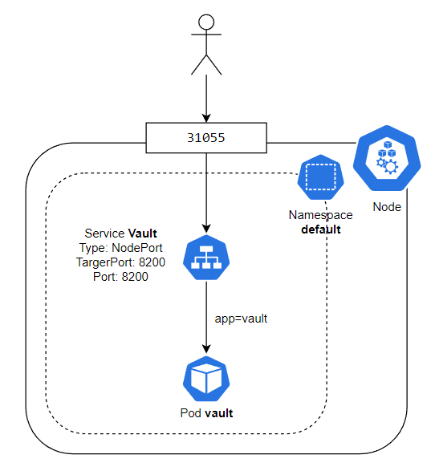

# Лабораторная работа №1 "Установка Docker и Minikube, мой первый манифест."

## Общая информация

University: [ITMO University](https://itmo.ru/ru/)

Faculty: [FICT](https://fict.itmo.ru)

Course: [Introduction to distributed technologies](https://github.com/itmo-ict-faculty/introduction-to-distributed-technologies)

Year: 2022/2023

Group: K4112c

Author: Orel Daniil Maximovich

Lab: Lab1

Date of create: 29.10.2022

Date of finished: 

## Ход работы

### Запуск кластера minikube

Для создания кластера minikube была использована следующая команда:
```bash
$ minikube start --driver=docker --kubernetes-version=v1.24.0
```

Данная команда использует Docker в качестве драйвера для запуска Kubernetes кластера. После создания кластера, необходимо проверить возможность подключения к нему. 

Для примера попытаемся получить все ресурсы созданного кластера:

```bash
$ kubectl get all -A

# Output:
NAMESPACE     NAME                                   READY   STATUS    RESTARTS      AGE
kube-system   pod/coredns-6d4b75cb6d-qf4z7           1/1     Running   0             59m
kube-system   pod/etcd-minikube                      1/1     Running   0             60m
kube-system   pod/kube-apiserver-minikube            1/1     Running   0             60m
kube-system   pod/kube-controller-manager-minikube   1/1     Running   0             60m
kube-system   pod/kube-proxy-2z2fr                   1/1     Running   0             59m
kube-system   pod/kube-scheduler-minikube            1/1     Running   0             60m
kube-system   pod/storage-provisioner                1/1     Running   1 (59m ago)   60m

NAMESPACE     NAME                 TYPE        CLUSTER-IP   EXTERNAL-IP   PORT(S)                  AGE
default       service/kubernetes   ClusterIP   10.96.0.1    <none>        443/TCP                  60m
kube-system   service/kube-dns     ClusterIP   10.96.0.10   <none>        53/UDP,53/TCP,9153/TCP   60m

NAMESPACE     NAME                        DESIRED   CURRENT   READY   UP-TO-DATE   AVAILABLE   NODE SELECTOR            AGE
kube-system   daemonset.apps/kube-proxy   1         1         1       1            1           kubernetes.io/os=linux   60m

NAMESPACE     NAME                      READY   UP-TO-DATE   AVAILABLE   AGE
kube-system   deployment.apps/coredns   1/1     1            1           60m

NAMESPACE     NAME                                 DESIRED   CURRENT   READY   AGE
kube-system   replicaset.apps/coredns-6d4b75cb6d   1         1         1       59m
```

### Запуск пода в Kubernetes кластере

После запуска кластера и проверки подключения, был создан манифест [pod.yaml](pod.yaml). Для развертывания пода была использована следущая команда: 

```bash
$ kubectl apply -f pod.yaml -n default
```

Убедимся, что pod стартовал успешно:

```bash
$ kubectl get po -n default

# Output
NAME    READY   STATUS    RESTARTS   AGE
vault   1/1     Running   0          46s
```

### Создание сервиса

Для обеспечения доступа к поду, был создан сервис `vault` типа NodePort:
```bash
$ kubectl expose pod vault --type NodePort --port 8200 -n default
```

Для получения созданного сервиса выполним следующую команду:
```bash
$ kubectl get svc -n default

# Output
NAME         TYPE        CLUSTER-IP     EXTERNAL-IP   PORT(S)          AGE
kubernetes   ClusterIP   10.96.0.1      <none>        443/TCP          81m
vault        NodePort    10.111.80.70   <none>        8200:31055/TCP   6s
```

### Получение доступа к контейнеру

```bash
kubectl port-forward -n default svc/vault 8200:8200 
```

Данная команда пробрасывает порт хоста в контейнер Vault. После выполнения данной команды, приложение будет доступно по адресу `http://localhost:8200`.



###  Получение токена для доступа в Vault

Получим логи контейнера с помощью команды и отфильтруем их с помощью утилиты grep: 
```bash
$ kubectl logs vault -n default | grep Token

# Output
Root Token: hvs.sxnDCzyWy7xvfaMK2wjefTRc
```

Вставим найденный токен в форму авторизации на странице приложения. При успешной авторизации откроется главная страница приложения Vault: 



### Схема организации контейнеров и сервисов


