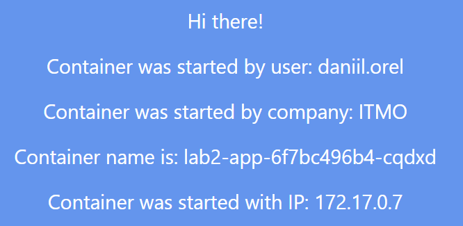
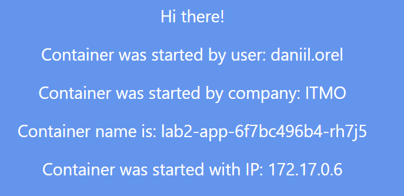
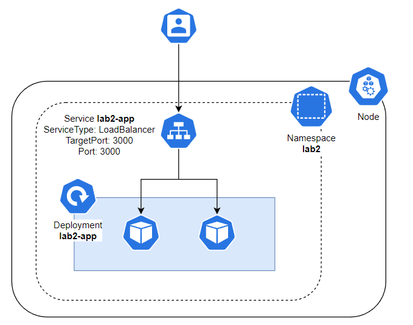

# Лабораторная работа №2 "Развертывание веб сервиса в Minikube, доступ к веб интерфейсу сервиса. Мониторинг сервиса.

## Общая информация

University: [ITMO University](https://itmo.ru/ru/)

Faculty: [FICT](https://fict.itmo.ru)

Course: [Introduction to distributed technologies](https://github.com/itmo-ict-faculty/introduction-to-distributed-technologies)

Year: 2022/2023

Group: K4112c

Author: Orel Daniil Maximovich

Lab: Lab2

Date of create: 29.10.2022

Date of finished:

## Ход работы

### Подготовительный этап

Создадим отдельный namespace для развертывания приложения:

```bash
$ kubectl create namespace lab2
```

Проверим, что namespace действительно создался: 

```bash
$ kubectl get ns

# Output
NAME              STATUS   AGE
default           Active   137m
kube-node-lease   Active   137m
kube-public       Active   137m
kube-system       Active   137m
lab2              Active   2s
```

### Создание Deployment

Для развертывания приложения был создан манифест [deployment.yaml](deployment.yaml). Deployment - это абстракция Kubernetes, которая позволяет управлять приложением, его версиями и обновлениями. В объекте Deployment хранится информация о конфигурации подов, количестве необходимых реплик и методе обновления подов в случае изменения их конфигурации.

При развертывании deployment создается еще одна абстракция - ReplicaSet. Она отвечает за описание и контроль за несколькими экземплярами приложений.

Для развертывания deployment используем следующую команду:

```bash
$ kubectl apply -f deployment.yaml -n lab2
```

Проверим какие ресурсы были созданы в итоге выполнения команды:

```bash
$ kubectl get all -n lab2

# Output: 
NAME                            READY   STATUS    RESTARTS   AGE
pod/lab2-app-6f7bc496b4-cqdxd   1/1     Running   0          17m
pod/lab2-app-6f7bc496b4-rh7j5   1/1     Running   0          17m

NAME                       READY   UP-TO-DATE   AVAILABLE   AGE
deployment.apps/lab2-app   2/2     2            2           17m

NAME                                  DESIRED   CURRENT   READY   AGE
replicaset.apps/lab2-app-6f7bc496b4   2         2         2       17m
```

Как видно из вывода, deployment создал новый объект ReplicaSet, который, в свою очередь, создал необходимое количество реплик приложений.

### Создание Service типа LoadBalancer 

Для предоставления доступа к подам деплоймента `lab2-app` был создан манифест [service.yaml](service.yaml). Данный манифест определяет Service типа LoadBalancer и выбирает поды, которые имеют selectorLabel `app=lab2-app`. 

Сервисы в Kubernetes позволяют определить набор подов и правила доступа к ним. С помощью сервисов разные части приложения могут "общаться" друг с другом (например, фронтенд с бэкендом).

Для создания описанного в манифесте сервиса была использована следующая команда:

```bash
$ kubectl apply -f service.yaml
```

Для того, чтобы определить правильно ли настроены селекторы для подов, выведем описание созданного сервиса:

```bash 
$ kubectl describe svc lab2-app -n lab2

# Output
Name:                     lab2-app
Namespace:                lab2
Labels:                   app=lab2-app
Annotations:              <none>
Selector:                 app=lab2-app
Type:                     LoadBalancer
IP Family Policy:         SingleStack
IP Families:              IPv4
IP:                       10.100.131.159
IPs:                      10.100.131.159
Port:                     http  3000/TCP
TargetPort:               3000/TCP
NodePort:                 http  32023/TCP
Endpoints:                172.17.0.6:3000,172.17.0.7:3000
Session Affinity:         None
External Traffic Policy:  Cluster
Events:                   <none>
```

В строке Enpoints приведены IP адреса подов, на которые сервис будет проксировать трафик. Сравним их с IP-адресам подов деплоймента lab2-app:

```bash
$ kubectl get po -n lab2 -o wide

# Output
NAME                        READY   STATUS    RESTARTS   AGE   IP           NODE       NOMINATED NODE   READINESS GATES
lab2-app-6f7bc496b4-cqdxd   1/1     Running   0          36m   172.17.0.7   minikube   <none>           <none>
lab2-app-6f7bc496b4-rh7j5   1/1     Running   0          36m   172.17.0.6   minikube   <none>           <none>
```

Как видно из вывода - IP-адреса совпадают.


### Тестирование работы сервиса

Команда `minikube tunnel` дает возможность получить доступ к сервису типа LoadBalancer на хосте. Используем ее для тестирования нашего приложения.

После выполнения данной команды откроем в браузере страницу http://localhost:3000 и обновим несколько раз.

 


Как видно на рисунках, имя и IP контейнера изменяется. Это происходит потому, что сервис проксирует запросы то на один под, то на другой.

### Логи контейнеров

Для получения логов контейнера в Kubernetes используется следующая команда:

```bash
$ kubectl logs <pod_name> -n <namespace>
```

Логи пода lab2-app-6f7bc496b4-rh7j5:

```bash
$ kubectl logs lab2-app-6f7bc496b4-rh7j5 -n lab2

# Output
Builing frontend
build finished
Server started on port 3000
```

### Схема организации контейнеров и сервисов

