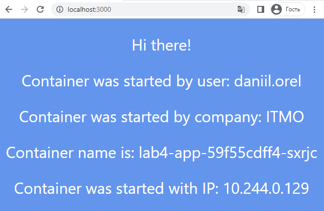
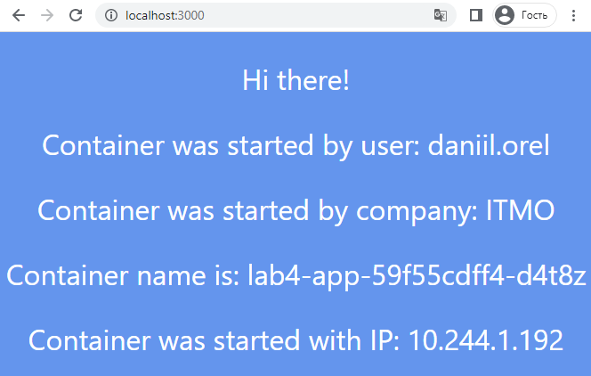

# Лабораторная работа №4 "Сети связи в Minikube, CNI и CoreDNS"

## Общая информация

University: [ITMO University](https://itmo.ru/ru/)

Faculty: [FICT](https://fict.itmo.ru)

Course: [Introduction to distributed technologies](https://github.com/itmo-ict-faculty/introduction-to-distributed-technologies)

Year: 2022/2023

Group: K4112c

Author: Orel Daniil Maximovich

Lab: Lab3

Date of create: 30.10.2022

Date of finished:

## Ход работы

### Запуск minikube кластера с несколькими нодами (Nodes) и CNI плагином calico

Для запуска кластера minikube с 2 нодами и плагином CNI calico, была использована следующая команда: 

```bash
$ minikube start --driver=docker -p multinode-cluster --network-plugin=cni --cni=calico --nodes=2 --kubernetes-version=v1.24.0
```

После запуска кластера были созданы 2 ноды:

```bash
$ kubectl get nodes

# Output
NAME                    STATUS   ROLES           AGE     VERSION
multinode-cluster       Ready    control-plane   2m45s   v1.25.2
multinode-cluster-m02   Ready    <none>          2m8s    v1.25.2
```

Проверка calico:

```bash
$ kubectl get po -n kube-system -l=k8s-app=calico-node

# Output:
NAME                READY   STATUS    RESTARTS   AGE
calico-node-mtmrt   1/1     Running   0          4m57s
calico-node-rcj29   1/1     Running   0          4m57s
```

## Установка calicoctl

```bash
$ curl -L https://github.com/projectcalico/calico/releases/download/v3.24.3/calicoctl-linux-amd64 -o calicoctl

$ chmod +x ./calicoctl

$ sudo mv ./calicoctl /usr/local/bin
```

## Подготовка IP pools

Удаление старого IP пула:

```bash
$ calicoctl delete ippools default-ipv4-ippool
```

Добавление меток для нод:

```bash
$ kubectl label nodes multinode-cluster zone=east
$ kubectl label nodes multinode-cluster-m02 zone=west
```

Создание IP пулов:

```bash
calicoctl create -f ip-pools.yaml
```

## Проверка назначения IP адресов

Развертывание тестого приложения:

```bash
$ kubectl apply -f deployment.yaml
$ kubectl apply -f service.yaml
```

Проверка IP-адресов:

```bash
$ kubectl get po -n default -o yaml

# Output:
NAME                        READY   STATUS    RESTARTS   AGE   IP             NODE                    NOMINATED NODE   READINESS GATES
lab4-app-59f55cdff4-d4t8z   1/1     Running   0          53s   10.244.1.192   multinode-cluster-m02   <none>           <none>
lab4-app-59f55cdff4-sxrjc   1/1     Running   0          53s   10.244.0.129   multinode-cluster       <none>           <none>
```

Запуск туннеля minikube:

```bash
$ minikube tunnel --profile=multinode-cluster
```

Тестирование приложения в браузере:





